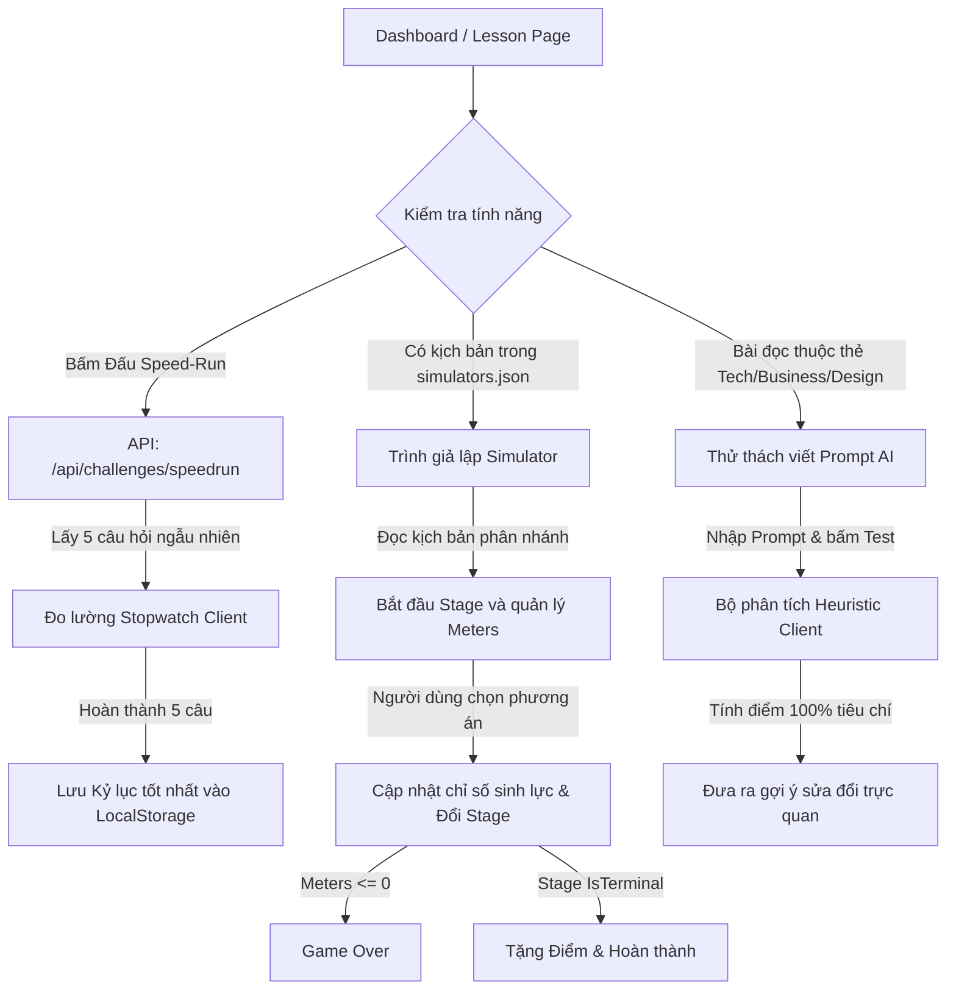

# Tài Liệu Kỹ Thuật: Tính Năng Học Tập Tương Tác Mới
*Bản đặc tả kỹ thuật (Spec), Phân rã công việc (Sprint/Tasks) & Hướng dẫn cấu hình kịch bản*

Tài liệu này đặc tả cấu trúc thiết kế, luồng xử lý và kế hoạch chạy việc cho 3 tính năng tương tác học tập cao cấp không tốn chi phí vận hành API: **Prompt Practice**, **Case-Study Simulator**, và **Speed-Run Duel**.

---

## 1. Bản Đặc Tả Kỹ Thuật (Product Specification)

### 1.1. Mục tiêu (Goals)
*   **Active Learning (Học chủ động):** Chuyển đổi từ mô hình đọc bài thụ động sang mô hình thực hành giải quyết tình huống thực tế và tư duy Prompt AI.
*   **Gamification (Game hóa):** Tạo thói quen truy cập mỗi ngày (Retention) qua cơ chế so kè thời gian stopwatch và lưu trữ kỷ lục cá nhân.
*   **Tối ưu hóa chi phí (Zero API Cost):** 100% logic phân tích và trạng thái hoạt động chạy trực tiếp ở client-side trong trình duyệt của người dùng.

### 1.2. Kiến trúc & Sơ đồ dữ liệu (Architecture & Data Flow)



---

## 2. Kế Hoạch Sprint & Phân Rã Công Việc (Sprint Backlog & Tasks)

Sprint này được triển khai trong vòng 1 tuần với các đầu việc chi tiết sau:

| Mã Task | Tên Đầu Việc (Task Name) | Trạng Thái | Mô Tả Chi Tiết |
| :--- | :--- | :--- | :--- |
| **TSK-101** | Tạo tệp cấu hình JSON kịch bản | `DONE` | Xây dựng cấu trúc cây kịch bản phân nhánh tĩnh tại `src/data/simulators.json`. |
| **TSK-102** | Xây dựng API Speedrun ngẫu nhiên | `DONE` | Viết endpoint `/api/challenges/speedrun` xáo trộn và trả về 5 câu hỏi trắc nghiệm bất kỳ. |
| **TSK-103** | Lập trình Trình giả lập Quyết định | `DONE` | Code state machine rẽ nhánh, quản lý 3 thanh tài nguyên (Meters) và console log tại `lessons/[id]/page.tsx`. |
| **TSK-104** | Lập trình Bộ chấm điểm Prompt AI | `DONE` | Thiết lập bộ lọc heuristic (Regex/Keyword) chấm điểm prompt theo tiêu chuẩn chuyên nghiệp. |
| **TSK-105** | Thiết kế Stopwatch và Kỷ lục tốc độ | `DONE` | Viết interval timer chính xác đến `0.1s` và lưu trữ thành tích vào `localStorage`. |
| **TSK-106** | Đồng bộ giao diện và Next.js Build | `DONE` | Áp dụng tone màu giấy ấm & Geist font và chạy build kiểm tra lỗi typescript. |

---

## 3. Hướng Dẫn Cấu Hình Kịch Bản Giả Lập (`simulators.json`)

Khi quản trị viên muốn bổ sung một game giả lập cho bài học mới, họ chỉ cần thêm một đối tượng JSON vào tệp `src/data/simulators.json` khớp với **tiêu đề chính xác** của bài học.

### 3.1. Cấu trúc Schema (JSON Schema)
```json
{
  "TÊN_CHÍNH_XÁC_CỦA_BÀI_HỌC": {
    "challenge": "Mô tả ngắn thử thách chung",
    "meters": [
      { "id": "tên_id_1", "name": "Tên hiển thị", "val": 100, "icon": "Emoji" },
      { "id": "tên_id_2", "name": "Tên hiển thị", "val": 100, "icon": "Emoji" }
    ],
    "stages": {
      "start": {
        "text": "Nội dung dẫn dắt ban đầu",
        "options": [
          {
            "text": "Lựa chọn A",
            "effectText": "Phản hồi hiển thị trên console khi bấm chọn",
            "changes": { "tên_id_1": -20, "tên_id_2": 10 },
            "nextStage": "stage_2"
          }
        ]
      },
      "stage_2": {
        "text": "Nội dung tình huống tiếp theo...",
        "options": []
      },
      "win": {
        "text": "Nội dung thông báo chiến thắng",
        "isTerminal": true,
        "score": 100
      },
      "game_over": {
        "text": "Nội dung thông báo thất bại",
        "isTerminal": true,
        "score": 0
      }
    }
  }
}
```

### 3.2. Quy tắc hoạt động của Simulator Engine
1.  **Khởi đầu:** Engine luôn tự động tìm stage có khóa `"start"`.
2.  **Cập nhật chỉ số:** Mỗi tùy chọn có mảng `changes` cộng hoặc trừ điểm của các `meters`. Nếu bất kỳ chỉ số nào chạm mốc `0`, hệ thống tự chuyển sang stage `"game_over"`.
3.  **Kết thúc:** Khi chuyển sang một stage có khóa `"isTerminal": true`, nút lựa chọn sẽ bị ẩn và hiển thị nút **Chơi lại**.
